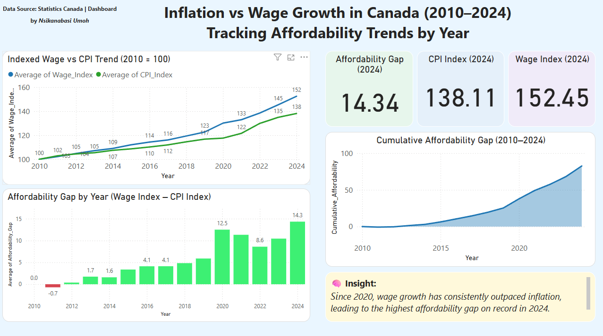

# 📊 Inflation vs Wage Growth in Canada (2010–2024)

**Built with Power BI | StatsCan Data | Affordability Index Analysis**

An interactive data visualization dashboard tracking the relationship between inflation and wage growth across Canada over 15 years. Highlights include affordability trends, gaps, and cumulative insights using public data from Statistics Canada.


## 📊 Dashboard Preview



## 📥 How to View the Dashboard

Due to hosting limitations, this Power BI dashboard was not published online.

To explore the interactive dashboard:

1. Download the `.pbix` file: [`InflationWage_Canada.pbix`](./Powerbi/Inflation_Wage_Dashboard.pbix)
2. Open it in the free [Power BI Desktop](https://powerbi.microsoft.com/en-us/desktop/)

---

### ✨ Features

| Feature                          | Description                                                | Visual Type     |
|----------------------------------|------------------------------------------------------------|-----------------|
| 📈 Indexed Trend                 | Compare Wage Index vs CPI Index from 2010–2024             | Line Chart      |
| 💰 Affordability Gap Tracker    | Visualizes annual wage-inflation spread                    | Column Chart    |
| 📊 Cumulative Affordability     | Measures long-term gap accumulation                        | Area Chart      |
| 🧠 Insight Annotation           | Summarized story backed by data trends                     | Text Card       |
| 🧾 KPI Cards (2024)             | Key indicators for Wage Index, CPI, and Affordability Gap  | KPI Cards       |

---

### 📊 Dataset Insights

| Metric                     | Value       |
|----------------------------|-------------|
| Timespan                  | 2010–2024   |
| Data Points               | 15 years    |
| Source                    | Statistics Canada |
| Main Variables            | CPI Index, Wage Index, Affordability Gap |

🧹 _Data cleaned & merged from multiple StatsCan tables. See Power Query steps in `.pbix` file._

---

### 🚀 Quick Start

> This project uses Power BI Desktop.

```bash
# 1. Clone the repository
git clone https://github.com/yourusername/inflation-wage-dashboard.git

# 2. Open the Power BI file
Open `Inflation_vs_Wage_Growth_Canada.pbix` in Power BI Desktop

# 3. Explore
Adjust slicers, filters, or export views for reporting
```

---

### 📌 Insight

> _Since 2020, wage growth has consistently outpaced inflation, leading to the highest affordability gap on record in 2024._

---

### 🔧 Tech Stack

| Tool       | Logo |
|------------|------|
| Power BI   |  |
| Python     |  |
| StatsCan Data | 🇨🇦 CSV Datasets |
| DAX        | 🧠 Custom Measures |
| UX Design  | 🎨 Rounded Cards, Layout Styling |

---

> 📂 Clone or fork this repo to explore the PBIX file and make your own enhancements!
© 2025 Nsikanabasi Umoh. All rights reserved.